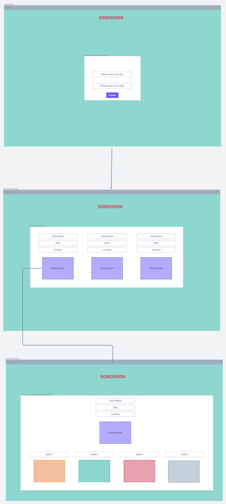

# Songshion

## Live Deployed Application (via Heroku)
https://secret-plateau-41597.herokuapp.com/

## GitHub Repository
https://github.com/Songshion/Songshion
​

## Application Description
A simple app that searches for live music events based on your city.

## User Story
AS A User,
I WANT to search for live music.
SO THAT I can find upcoming live music near me.

## Acceptance Criteria
GIVEN I am interested in a live music event.
WHEN I click the search city button.
THEN the page will display live music events with venue name, address, date/time, and genre.
WHEN I click on a live-music image
THEN I a new page displays similar fashion ideas based on the artist.

## Wireframe

## CSS Libraries 
​
[Link to Ant Design React](https://ant.design/docs/react/introduce)
​
​
## Application Authors:
​
[Kyaah Ellis](https://github.com/KyaahB)
​
[Tejesh Patel](https://github.com/tejeshpatel)
​
[Joseph Sumis](https://github.com/JSumis)
​
[Sydney Williams](https://github.com/sydneyw-cyber)
​
​
## Songshion Working Agreement
​
1. Working Through Disagreements:
   a. To work through disagreements we will talk through the opposing sides and come to the most logical solution that the majority agrees on.
  
2. When We’ll Work 
   a. We’re going to be honest with each other about our abilities and other life commitments when scheduling project work time. We’ll communicate with each other at least once a day to make sure the work is getting done.
​
3. How We’ll Make Sure We’re All Included 
   a. In order to make sure we are all committing at a similar pace, and work is split up fairly. We will accomplish this by pairing up and splitting up the work based on our strengths.